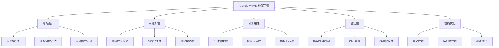

# Android MVVM 框架架构审查设计文档

## 概述

本设计文档详细描述了对 Android MVVM 开发框架进行全面架构审查的方法论、评估标准和改进建议。审查将采用系统化的方法，从五个核心维度深入分析框架的设计质量。

## 架构审查方法论

### 审查维度框架



## 组件和接口设计

### 1. 结构设计审查组件

#### 包结构分析器
```kotlin
interface PackageStructureAnalyzer {
    fun analyzePackageHierarchy(): PackageAnalysisResult
    fun validateNamingConventions(): List<NamingIssue>
    fun checkModuleCohesion(): CohesionReport
}

data class PackageAnalysisResult(
    val depth: Int,
    val moduleCount: Int,
    val crossDependencies: List<Dependency>,
    val recommendations: List<String>
)
```

#### 架构分层评估器
```kotlin
interface ArchitectureLayerEvaluator {
    fun validateMVVMImplementation(): MVVMComplianceReport
    fun checkLayerSeparation(): LayerSeparationReport
    fun analyzeDependencyDirection(): DependencyFlowReport
}
```

### 2. 可维护性审查组件

#### 代码质量分析器
```kotlin
interface CodeQualityAnalyzer {
    fun checkNamingConventions(): NamingReport
    fun analyzeComplexity(): ComplexityReport
    fun validateDocumentation(): DocumentationReport
}

data class ComplexityReport(
    val cyclomaticComplexity: Map<String, Int>,
    val methodLength: Map<String, Int>,
    val classSize: Map<String, Int>,
    val suggestions: List<RefactoringSuggestion>
)
```

### 3. 可复用性审查组件

#### 组件抽象度分析器
```kotlin
interface ComponentAbstractionAnalyzer {
    fun evaluateBaseClasses(): AbstractionReport
    fun checkInterfaceDesign(): InterfaceDesignReport
    fun analyzeConfigurability(): ConfigurabilityReport
}
```

### 4. 健壮性审查组件

#### 异常处理分析器
```kotlin
interface ExceptionHandlingAnalyzer {
    fun checkGlobalExceptionHandling(): ExceptionHandlingReport
    fun validateErrorRecovery(): ErrorRecoveryReport
    fun analyzeBoundaryConditions(): BoundaryConditionReport
}
```

#### 内存管理分析器
```kotlin
interface MemoryManagementAnalyzer {
    fun detectMemoryLeaks(): MemoryLeakReport
    fun analyzeResourceManagement(): ResourceManagementReport
    fun checkLifecycleCompliance(): LifecycleComplianceReport
}
```

### 5. 性能优化审查组件

#### 性能分析器
```kotlin
interface PerformanceAnalyzer {
    fun analyzeStartupPerformance(): StartupPerformanceReport
    fun checkMemoryUsage(): MemoryUsageReport
    fun evaluateNetworkEfficiency(): NetworkEfficiencyReport
    fun assessUIPerformance(): UIPerformanceReport
}
```

## 数据模型

### 审查报告数据模型

```kotlin
data class FrameworkAuditReport(
    val frameworkInfo: FrameworkInfo,
    val structuralDesign: StructuralDesignReport,
    val maintainability: MaintainabilityReport,
    val reusability: ReusabilityReport,
    val robustness: RobustnessReport,
    val performance: PerformanceReport,
    val overallScore: Double,
    val prioritizedRecommendations: List<Recommendation>
)

data class FrameworkInfo(
    val name: String,
    val version: String,
    val architecture: String,
    val techStack: List<String>,
    val codebaseSize: CodebaseMetrics
)

data class CodebaseMetrics(
    val totalFiles: Int,
    val linesOfCode: Int,
    val kotlinFiles: Int,
    val xmlFiles: Int,
    val testFiles: Int
)
```

### 评估标准数据模型

```kotlin
data class EvaluationCriteria(
    val category: AuditCategory,
    val weight: Double,
    val criteria: List<Criterion>
)

data class Criterion(
    val name: String,
    val description: String,
    val weight: Double,
    val evaluationMethod: EvaluationMethod
)

enum class AuditCategory {
    STRUCTURAL_DESIGN,
    MAINTAINABILITY,
    REUSABILITY,
    ROBUSTNESS,
    PERFORMANCE
}
```

## 错误处理

### 审查过程错误处理

```kotlin
sealed class AuditException(message: String) : Exception(message) {
    class CodebaseAccessException(message: String) : AuditException(message)
    class AnalysisException(message: String) : AuditException(message)
    class ReportGenerationException(message: String) : AuditException(message)
}

interface ErrorHandler {
    fun handleAuditError(error: AuditException): ErrorHandlingResult
    fun logAuditIssue(issue: AuditIssue)
    fun generateErrorReport(errors: List<AuditException>): ErrorReport
}
```

## 测试策略

### 审查工具测试

```kotlin
interface AuditToolTester {
    fun testPackageAnalyzer(): TestResult
    fun testCodeQualityAnalyzer(): TestResult
    fun testPerformanceAnalyzer(): TestResult
    fun validateReportGeneration(): TestResult
}
```

### 审查结果验证

```kotlin
interface AuditResultValidator {
    fun validateReportCompleteness(report: FrameworkAuditReport): ValidationResult
    fun checkRecommendationRelevance(recommendations: List<Recommendation>): ValidationResult
    fun verifyScoreCalculation(report: FrameworkAuditReport): ValidationResult
}
```

## 具体审查实施计划

### 阶段 1：结构设计审查

1. **包结构分析**
   - 分析当前包层次结构的深度和合理性
   - 检查模块间的依赖关系和耦合度
   - 评估命名规范的一致性

2. **架构分层评估**
   - 验证 MVVM 架构的标准实现
   - 检查 Presentation、Domain、Data 层的职责分离
   - 分析依赖注入的使用情况

3. **设计模式识别**
   - 识别已使用的设计模式（Repository、Factory、Observer 等）
   - 评估设计模式的适用性和实现质量

### 阶段 2：可维护性审查

1. **代码规范检查**
   - 验证 Kotlin 编码规范的遵循情况
   - 检查注释的完整性和质量
   - 分析代码风格的一致性

2. **复杂度分析**
   - 计算圈复杂度和方法长度
   - 识别过于复杂的类和方法
   - 提供重构建议

3. **文档评估**
   - 检查 API 文档的完整性
   - 评估使用指南和示例代码的质量
   - 分析文档的维护状态

### 阶段 3：可复用性审查

1. **组件抽象度评估**
   - 分析 Base 类的抽象程度
   - 检查工具类的通用性
   - 评估接口设计的灵活性

2. **配置化程度分析**
   - 识别硬编码的配置项
   - 评估配置的灵活性和可扩展性
   - 检查环境配置的完整性

3. **模块化程度评估**
   - 分析功能模块的独立性
   - 检查模块间的可插拔性
   - 评估模块的可重用性

### 阶段 4：健壮性审查

1. **异常处理机制分析**
   - 检查全局异常处理的完整性
   - 分析错误恢复机制
   - 评估用户友好的错误提示

2. **内存管理评估**
   - 识别潜在的内存泄漏风险
   - 检查资源管理的正确性
   - 分析生命周期的合规性

3. **线程安全性检查**
   - 评估并发访问的安全性
   - 检查协程使用的正确性
   - 分析数据同步机制

### 阶段 5：性能优化审查

1. **启动性能分析**
   - 评估应用启动时间
   - 分析初始化过程的优化空间
   - 检查懒加载的实现

2. **运行时性能评估**
   - 分析内存使用效率
   - 检查网络请求的性能
   - 评估 UI 渲染性能

3. **资源优化检查**
   - 分析资源文件的优化程度
   - 检查缓存策略的有效性
   - 评估数据库查询效率

## 改进建议分类

### 优先级分类

```kotlin
enum class RecommendationPriority {
    CRITICAL,    // 严重问题，需要立即修复
    HIGH,        // 重要问题，应尽快修复
    MEDIUM,      // 一般问题，可以计划修复
    LOW          // 优化建议，可以考虑实施
}
```

### 改进类型分类

```kotlin
enum class ImprovementType {
    ARCHITECTURE,     // 架构改进
    CODE_QUALITY,     // 代码质量改进
    PERFORMANCE,      // 性能优化
    SECURITY,         // 安全性改进
    MAINTAINABILITY,  // 可维护性改进
    DOCUMENTATION     // 文档改进
}
```

## 报告生成策略

### 报告结构

1. **执行摘要**
   - 整体评分和关键发现
   - 优先级最高的改进建议
   - 框架成熟度评估

2. **详细分析**
   - 各维度的详细评估结果
   - 具体问题和改进建议
   - 最佳实践对比

3. **实施计划**
   - 改进建议的实施优先级
   - 预估的工作量和时间
   - 风险评估和缓解策略

### 可视化设计

- 使用雷达图展示五个维度的评分
- 使用热力图显示代码质量分布
- 使用趋势图展示性能指标
- 使用流程图说明架构改进建议