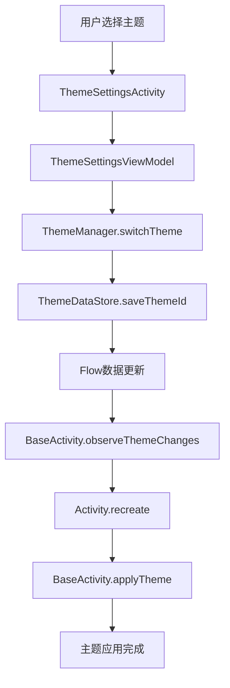

# 🎨 主题系统架构文档

## 📋 概述

本文档详细介绍了DemoAppNoCompose项目中主题配色系统的架构设计、实现原理和使用方法。该系统基于Material Design 3规范，支持多主题切换、暗黑模式、跟随系统等特性。

## 🏗️ 系统架构

### 整体架构图

```
┌─────────────────────────────────────────────────────────────┐
│                    主题系统架构                              │
├─────────────────────────────────────────────────────────────┤
│  UI层 (Presentation Layer)                                 │
│  ┌─────────────────┐  ┌─────────────────┐  ┌──────────────┐ │
│  │ ThemeSettings   │  │ BaseActivity    │  │ 各种Activity │ │
│  │ Activity        │  │ (主题应用)      │  │ (自动继承)   │ │
│  └─────────────────┘  └─────────────────┘  └──────────────┘ │
├─────────────────────────────────────────────────────────────┤
│  管理层 (Manager Layer)                                     │
│  ┌─────────────────────────────────────────────────────────┐ │
│  │              ThemeManager (核心管理器)                  │ │
│  │  • 主题切换逻辑                                         │ │
│  │  • 暗黑模式管理                                         │ │
│  │  • 系统配置监听                                         │ │
│  │  • 颜色获取工具                                         │ │
│  └─────────────────────────────────────────────────────────┘ │
├─────────────────────────────────────────────────────────────┤
│  数据层 (Data Layer)                                        │
│  ┌─────────────────┐  ┌─────────────────┐  ┌──────────────┐ │
│  │ ThemeDataStore  │  │ Theme.kt        │  │ 扩展函数     │ │
│  │ (数据存储)      │  │ (数据模型)      │  │ (便捷API)    │ │
│  └─────────────────┘  └─────────────────┘  └──────────────┘ │
├─────────────────────────────────────────────────────────────┤
│  资源层 (Resource Layer)                                    │
│  ┌─────────────────┐  ┌─────────────────┐  ┌──────────────┐ │
│  │ colors.xml      │  │ themes.xml      │  │ attrs.xml    │ │
│  │ (颜色定义)      │  │ (主题样式)      │  │ (自定义属性) │ │
│  └─────────────────┘  └─────────────────┘  └──────────────┘ │
└─────────────────────────────────────────────────────────────┘
```

### 核心组件

#### 1. 数据模型层
- **AppTheme**: 主题枚举，定义3套主题（Default、Business、Vibrant）
- **ThemeConfig**: 主题配置数据类，包含当前主题、暗黑模式、跟随系统等设置

#### 2. 数据存储层
- **ThemeDataStore**: 基于DataStore的主题数据持久化
- **ThemeModule**: Hilt依赖注入配置

#### 3. 管理层
- **ThemeManager**: 核心管理器，负责主题切换、暗黑模式管理、系统配置监听

#### 4. UI层
- **BaseActivity**: 基类Activity，自动应用主题
- **ThemeSettingsActivity**: 主题设置页面
- **扩展函数**: 便捷的颜色获取和View设置方法

## 🔄 主题切换流程

### 流程图



### 详细步骤

1. **用户操作**: 在ThemeSettingsActivity中选择主题
2. **ViewModel处理**: ThemeSettingsViewModel接收用户操作
3. **管理器调用**: 调用ThemeManager.switchTheme()方法
4. **数据持久化**: ThemeDataStore保存主题ID到DataStore
5. **数据流更新**: Flow发出新的主题配置数据
6. **Activity监听**: BaseActivity监听到主题变化
7. **Activity重启**: 调用recreate()重启Activity
8. **主题应用**: 在onCreate中调用applyTheme()应用新主题

## 🌙 暗黑模式实现

### 实现原理

1. **系统检测**: 通过Configuration.UI_MODE_NIGHT_MASK检测系统暗黑模式
2. **跟随系统**: 当followSystem=true时，自动使用系统设置
3. **手动控制**: 当followSystem=false时，使用用户手动设置
4. **动态切换**: 监听系统配置变化，自动切换主题

### 配置变化监听

```kotlin
override fun onConfigurationChanged(newConfig: Configuration) {
    super.onConfigurationChanged(newConfig)
    
    val isDarkMode = (newConfig.uiMode and Configuration.UI_MODE_NIGHT_MASK) == Configuration.UI_MODE_NIGHT_YES
    
    currentThemeConfig?.let { themeConfig ->
        if (themeConfig.followSystem && themeConfig.isDarkMode != isDarkMode) {
            recreate()
        }
    }
}
```

## 🎨 颜色系统设计

### 颜色层级体系

基于Material Design 3规范，采用以下颜色层级：

#### 主色系 (Primary Colors)
- `colorPrimary`: 主色
- `colorPrimaryVariant`: 主色变体
- `colorOnPrimary`: 主色上的内容色

#### 次色系 (Secondary Colors)
- `colorSecondary`: 次色
- `colorSecondaryVariant`: 次色变体
- `colorOnSecondary`: 次色上的内容色

#### 背景色系 (Background Colors)
- `colorBackground`: 背景色
- `colorSurface`: 表面色
- `colorOnBackground`: 背景上的内容色
- `colorOnSurface`: 表面上的内容色

#### 功能色系 (Functional Colors)
- `colorError`: 错误色
- `colorSuccess`: 成功色
- `colorWarning`: 警告色
- `colorInfo`: 信息色

#### 文本色系 (Text Colors)
- `textColorPrimary`: 主要文本色
- `textColorSecondary`: 次要文本色
- `textColorTertiary`: 第三级文本色
- `textColorDisabled`: 禁用文本色

### 主题配色方案

#### 1. Default主题（默认主题）
- **主色**: #2196F3 (蓝色)
- **风格**: 简洁现代，适合日常使用
- **适用场景**: 通用应用，用户群体广泛

#### 2. Business主题（商务主题）
- **主色**: #1976D2 (深蓝色)
- **风格**: 专业商务，适合办公场景
- **适用场景**: 企业应用，商务办公

#### 3. Vibrant主题（活力主题）
- **主色**: #9C27B0 (紫色)
- **风格**: 活泼时尚，适合年轻用户
- **适用场景**: 娱乐应用，年轻用户群体

## 🛠️ 技术实现细节

### 依赖注入配置

```kotlin
@Module
@InstallIn(SingletonComponent::class)
object ThemeModule {
    @Provides
    @Singleton
    fun provideThemeDataStore(dataStore: DataStore<Preferences>): ThemeDataStore {
        return ThemeDataStore(dataStore)
    }
    
    @Provides
    @Singleton
    fun provideThemeManager(
        @ApplicationContext context: Context,
        themeDataStore: ThemeDataStore
    ): ThemeManager {
        return ThemeManager(context, themeDataStore)
    }
}
```

### 主题应用机制

```kotlin
private fun applyTheme() {
    if (!::themeManager.isInitialized) {
        return
    }
    
    lifecycleScope.launch {
        themeManager.getCurrentThemeConfig().collect { themeConfig ->
            currentThemeConfig = themeConfig
            
            val isDarkMode = if (themeConfig.followSystem) {
                themeManager.isSystemDarkMode(this@BaseActivity)
            } else {
                themeConfig.isDarkMode
            }
            
            val finalThemeConfig = themeConfig.copy(isDarkMode = isDarkMode)
            themeManager.applyTheme(this@BaseActivity, finalThemeConfig)
        }
    }
}
```

### 状态栏适配

```kotlin
protected open fun initStatusBar() {
    val statusBarColor = getPrimaryColor()
    window.statusBarColor = statusBarColor
    
    val isLightStatusBar = isLightColor(statusBarColor)
    WindowInsetsControllerCompat(window, window.decorView).apply {
        isAppearanceLightStatusBars = isLightStatusBar
    }
}
```

## 📊 性能优化

### 1. 颜色获取优化
- 使用TypedValue缓存颜色解析结果
- 避免重复解析相同属性

### 2. 主题切换优化
- 使用Flow进行响应式数据流管理
- 避免不必要的Activity重启

### 3. 内存优化
- 使用单例模式管理ThemeManager
- 合理使用DataStore进行数据持久化

## 🔧 扩展性设计

### 添加新主题

1. 在`AppTheme`枚举中添加新主题
2. 在`colors.xml`中定义新主题的颜色
3. 在`themes.xml`中创建新主题样式
4. 在`ThemeSettingsActivity`中添加主题选项

### 添加新颜色属性

1. 在`attrs.xml`中定义新属性
2. 在`themes.xml`中为新属性赋值
3. 在`ColorExt.kt`中添加对应的扩展函数

## 🐛 常见问题

### 1. 主题切换不生效
- 检查Activity是否继承自BaseActivity
- 确认ThemeManager是否正确注入
- 验证主题资源文件是否正确配置

### 2. 暗黑模式不跟随系统
- 检查followSystem设置是否正确保存
- 确认onConfigurationChanged方法是否被调用
- 验证系统暗黑模式检测逻辑

### 3. 状态栏颜色不正确
- 检查initStatusBar方法是否被调用
- 确认主色获取是否正确
- 验证状态栏图标颜色计算逻辑

## 📈 未来规划

### 短期目标
- 添加更多主题配色方案
- 优化主题切换动画效果
- 增加主题预览功能

### 长期目标
- 支持自定义主题创建
- 添加主题导入导出功能
- 实现主题市场功能

---

*本文档最后更新时间: 2024年10月*
